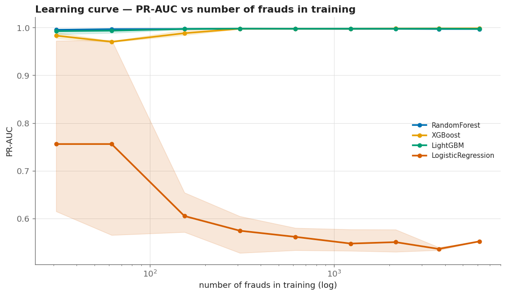
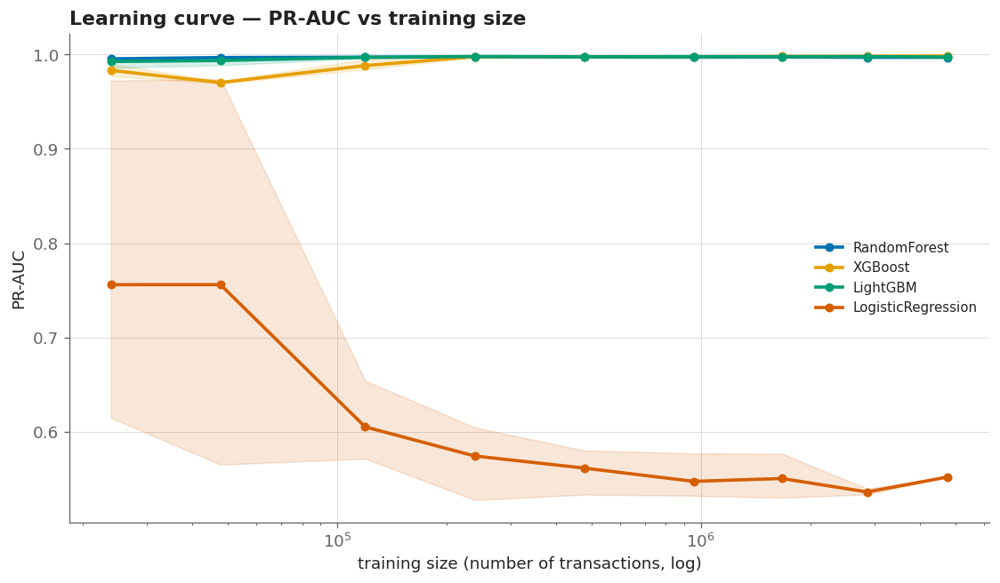
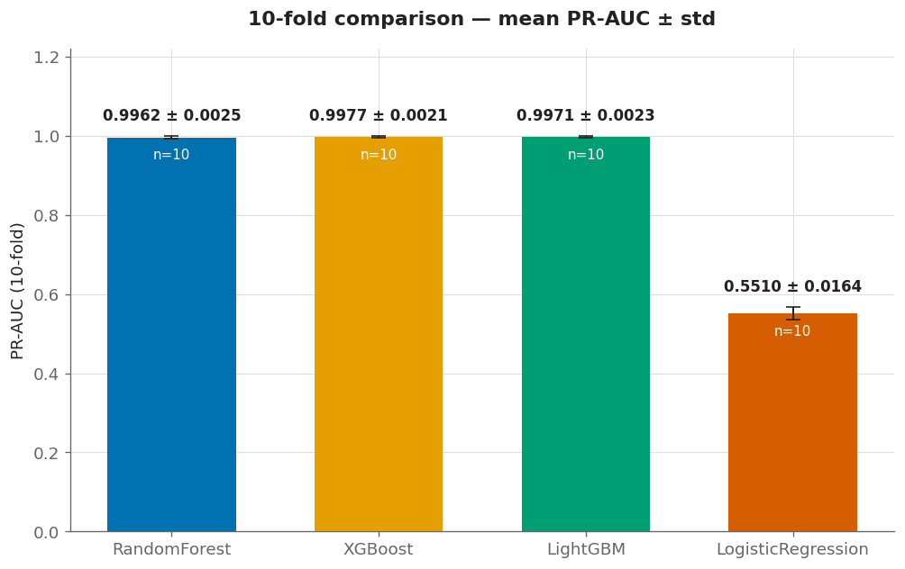
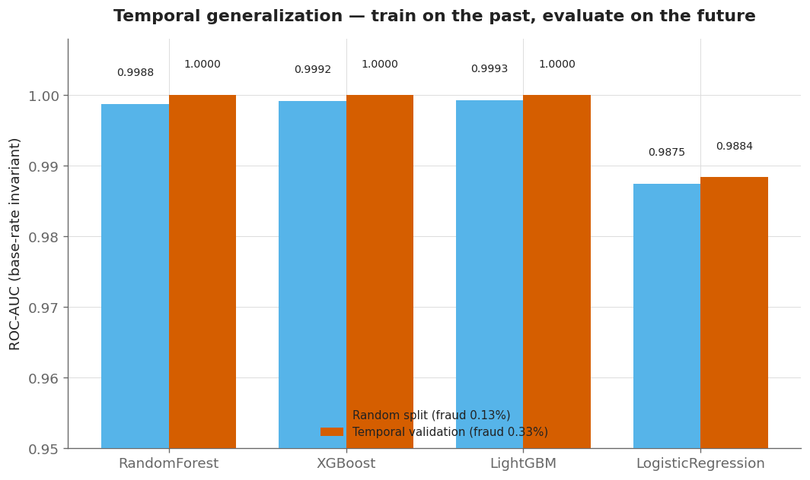
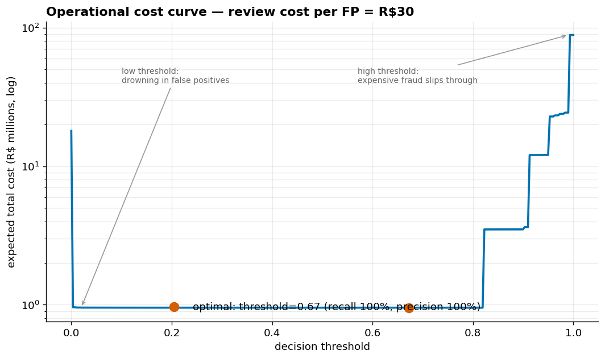
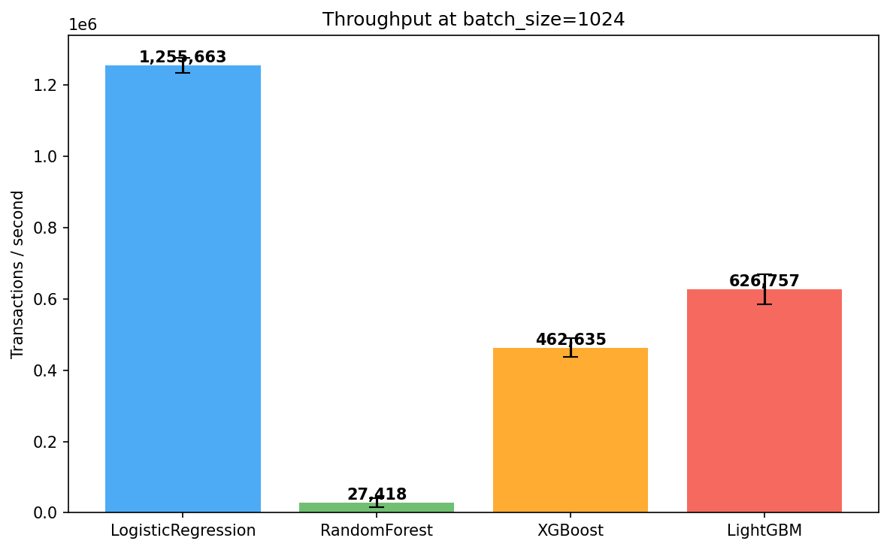
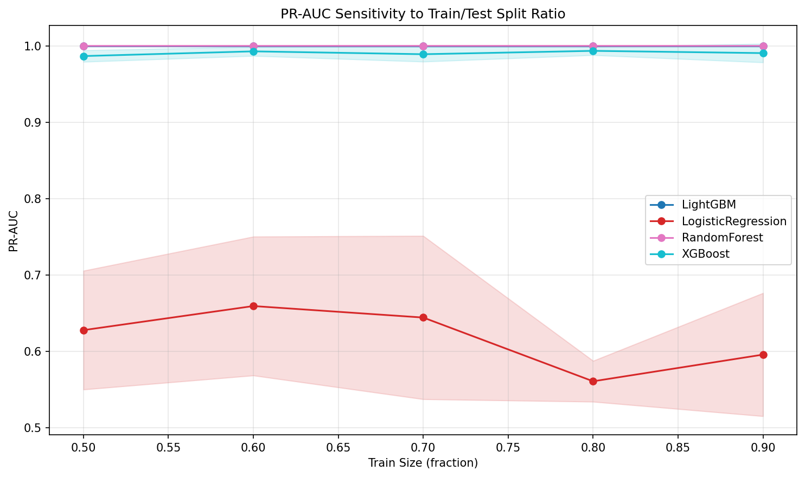
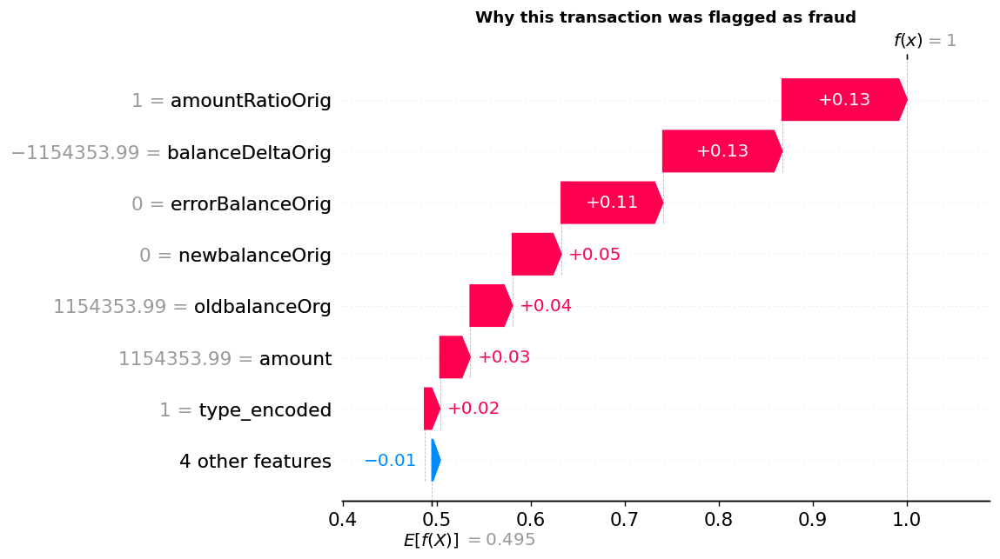

# Fraud Detection

🇧🇷 [Português](README.md)  ·  🇬🇧 **English**

> Financial transaction fraud detection with Machine Learning, stratified cross-validation, and analysis across 6.3 million transactions.

[](https://www.python.org/)
[](https://scikit-learn.org/)

---

## About the Project

A fraud detection system built on the **PaySim** dataset (6.3 million simulated financial transactions). It tackles one of the biggest challenges in digital payments: catching fraud under extreme class imbalance (only 0.13% fraud).

### How the project evolved

1. **Honest baseline** — I started by fixing the tree models for the extreme imbalance
   (`class_weight` / `scale_pos_weight`); without it, "99.87% accuracy" hid near-zero detection.
2. **The right metric** — I adopted **PR-AUC** as the primary metric (accuracy and even ROC-AUC
   mislead at 0.13% fraud).
3. **Robustness analyses** — model agreement (quadrant), operational queue (queue emulation), and
   PR-AUC sensitivity to split size.
4. **Scale** — I ran the pipeline on the **full dataset (6.3M)** for real numbers, not a sample.
5. **Data efficiency** — the learning curve showed the signal is learnable from **~30 frauds**;
   the 6.3M rows are redundant.

---

## Results

Run on the **full dataset** (6,362,620 transactions, 0.129% fraud; train 5,090,096 /
test 1,272,524) on Kaggle. Primary metric: **PR-AUC**.

### Model comparison (5-fold cross-validation, mean PR-AUC ± std)

| Model | PR-AUC (CV) |
|-------|:-----------:|
| **Random Forest** | **0.9978 ± 0.0009** |
| XGBoost | 0.9973 ± 0.0013 |
| LightGBM | 0.9967 ± 0.0013 |
| Logistic Regression | 0.5547 ± 0.0097 |

**Best model (Random Forest) on the hold-out test:** PR-AUC **0.9987** · ROC-AUC 0.9998 ·
F1 0.9800 · precision 0.96 / recall 1.00 (1,643 frauds). Stable across folds (ROC-AUC ~0.9994).

### Highlights

- **Logistic Regression** makes the central point: ROC-AUC ~0.98 but PR-AUC of only **0.55** —
  at 0.13% fraud, accuracy and even ROC-AUC mislead; only PR-AUC reveals real quality.
- **Engineered features dominate:** `amountRatioOrig`, `balanceDeltaOrig`, `errorBalanceOrig`
  (balance inconsistencies) outweigh the raw values.
- **Stratified 5-fold cross-validation** with mean ± std for statistical significance.

### Data efficiency — how many frauds does the model really need?

Learning curve with a **fixed test set** (1.59M rows): only the **training** size varies
(stratified subsampling, 3 seeds) to isolate the effect of data volume. Result: the **tree models
(Random Forest, XGBoost, LightGBM) keep PR-AUC ~0.97–0.999 training on just ~30 frauds** — the
signal is learnable from very few examples. The 8,213 frauds / 6.3M rows are **massively redundant**,
with direct impact on retraining cost and latency in production.





### Robustness — 10-fold cross-validation

10-fold confirms the 5-fold comparison across all four models: **XGBoost 0.9977 ± 0.0021**,
LightGBM 0.9971 ± 0.0023, Random Forest 0.9962 ± 0.0025, Logistic Regression 0.5510 ± 0.0164.



> GBDT tuning lesson: XGBoost and LightGBM require proper hyperparameters for extreme imbalance.
> The library defaults (XGBoost 100 trees/lr=0.3; LightGBM `is_unbalance=True`) **destabilize
> PR-AUC** — entire folds collapse to ~0.01–0.05 while ROC-AUC stays ~0.9 and **hides** it. With the
> tuned configs (500 trees, lr=0.05, regularization; `class_weight="balanced"`) all four models are
> stable — verified **locally and on Kaggle**.

### Temporal validation — does the model generalize to the future?

Beyond the random split, I reserved the **last time period** as **validation** — data that
**never** entered training or testing. Training only on the past and evaluating on the future:



- **Fraud is non-stationary:** ~46% of frauds are in the last time decile (train 0.08% vs
  validation 0.33%). Even so, **the signal generalizes** — ROC-AUC ~1.0 in the future.
- **Methodological caveat:** PR-AUC is **not** comparable across periods with different base rates
  (it grows with the fraud rate); I used **ROC-AUC** and **normalized PR-AUC** for a fair comparison.
- **Feature drift:** `errorBalanceOrig` (a top global feature) **loses power in the future** — the
  fraud *mechanism* changes, not just its rate. In production this would require monitoring feature
  drift, not just performance drops.

### Cost analysis — which threshold to use?

The best threshold is not the one with the highest PR-AUC, but the one with the **lowest expected
cost**: each **false negative** costs the **real value** of the fraud that slipped through (its
`amount`); each **false positive** costs an analyst's review. With a review cost of R$30, the
optimal point sits at **recall 99.6% / precision 100%** — the two failure regimes (low threshold =
drowning in false positives; high = expensive fraud slips through) show at the curve's ends.



### Why PR-AUC and not Accuracy?

In datasets with 99.87% legitimate transactions, a model that labels everything "not fraud" would
score 99.87% accuracy. PR-AUC specifically evaluates the model's ability to find real frauds
(recall) without generating excessive false alarms (precision).

---

## Dataset — PaySim

| Property | Value |
|----------|-------|
| Transactions | 6,362,620 |
| Attributes | 11 model features (5 kept originals + 6 engineered) |
| Frauds | 8,213 (0.13%) |
| Period | 30 simulated days |
| Types | CASH_IN, CASH_OUT, DEBIT, PAYMENT, TRANSFER |

**Key finding:** fraud concentrates in only 2 types — TRANSFER (0.77%) and CASH_OUT (0.18%). The
other types have zero fraud rate.

---

## Pipeline

```
Raw data (6,362,620 transactions, 11 columns)
  |
  v
Feature engineering (6 engineered)
  |-- balanceDeltaOrig / balanceDeltaDest   (origin/destination balance change)
  |-- errorBalanceOrig / errorBalanceDest    (accounting balance inconsistency)
  |-- amountRatioOrig                          (amount / origin balance)
  |-- type_encoded                             (encoded transaction type)
  |   dropped: nameOrig, nameDest, step, raw type, isFlaggedFraud
  |
  v
Stratified train/test split (80/20 -> 5.09M / 1.27M, preserves 0.13% fraud)
  |
  v
5-fold stratified CV on TRAIN   (model comparison by PR-AUC)
  |
  v
Best model: Random Forest
  |
  v
Evaluation on the hold-out TEST (1.27M)   ->   PR-AUC 0.9987
```

---

## Technical Highlights

- **Extreme imbalance** handled with the right metrics (PR-AUC, not accuracy)
- **6 engineered features** from balance patterns and transaction type
- **Memory optimization** with tuned dtypes to process 6.3M rows
- **Stratified split** preserving the fraud ratio in train/test and each fold

---

## Advanced Analyses

### Quadrant Analysis (model agreement)

Agreement/disagreement across the 4 models via out-of-fold predictions (5-fold).
**Result:** with tuned configs the 4 models are **highly concordant (~97% agreement)**; the small
**~3% disagreement zone is modestly fraud-enriched (~1.7x the base rate)** — a secondary signal for
prioritizing human review.

### Queue Emulation (latency and throughput)

Measures inference latency (p50/p95/p99) and per-batch throughput for each model.
**Result — latency vs accuracy trade-off:** RandomForest is the most accurate (PR-AUC 0.998) but
the **slowest** (p50 ~29 ms, ~27k tx/s); **LightGBM/XGBoost are ~100x faster** (1-2 ms,
460-627k tx/s) with PR-AUC ~0.997. For **high-volume** production, a GBDT is worth the marginal
accuracy gap.



### PR-AUC Splits Analysis

PR-AUC sensitivity to the train/test ratio (50-90%, 3 repetitions).
**Result:** RandomForest's PR-AUC stays **stable at ~0.9999 from 50% to 90% training** —
insensitive to split size (reinforcing the learning curve's data efficiency).



### Explainability (SHAP) — why each alert?

Each prediction is attributed to the features that drove it (auditability — the analyst needs to
know *why* an alert fired). E.g.: a transaction that **emptied a R$1.15M account** is flagged as
fraud with f(x)=1.0, and SHAP shows exactly which signals weighed in. SHAP's additivity property
was validated by test (sum of SHAP + base = probability, error ~1e-14).



---

## Tech Stack

| Category | Technologies |
|----------|--------------|
| ML | scikit-learn (LR, DT, RF, GBM), XGBoost, LightGBM |
| Data | pandas, NumPy |
| Visualization | Matplotlib, Seaborn, UMAP |
| Evaluation | StratifiedKFold (CV), temporal holdout, PR-AUC, ROC-AUC, Confusion Matrix |
| Quality | pytest (58 tests), black, isort, flake8, GitHub Actions |

---

## Author

**Fernando Marciano** — [LinkedIn](https://www.linkedin.com/in/fernandopmarciano/)

---

> Interested in the source code or a demo? Reach out on [LinkedIn](https://www.linkedin.com/in/fernandopmarciano/).
