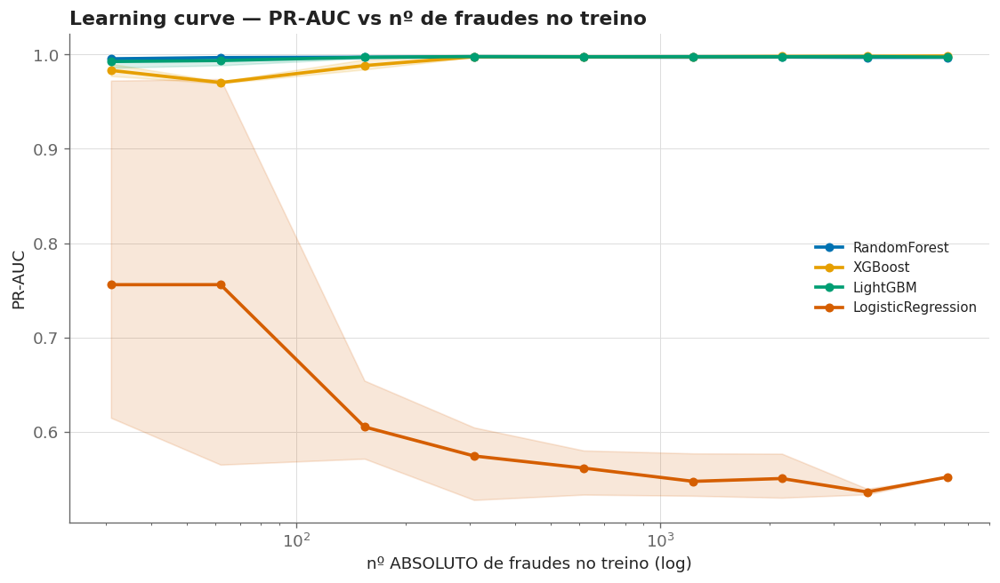
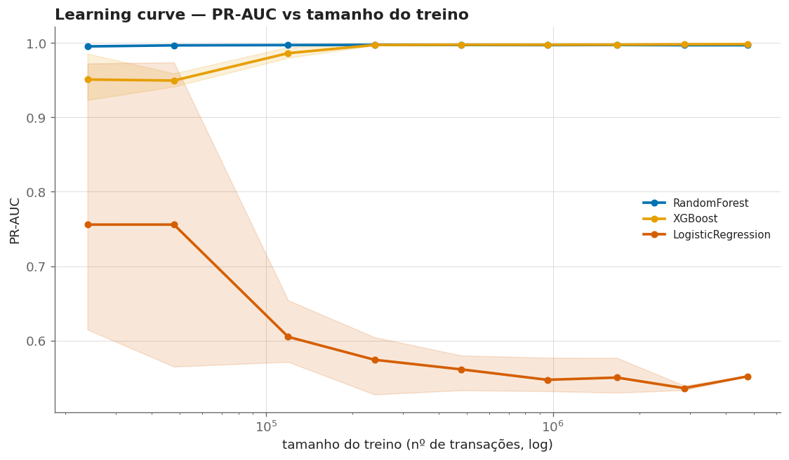
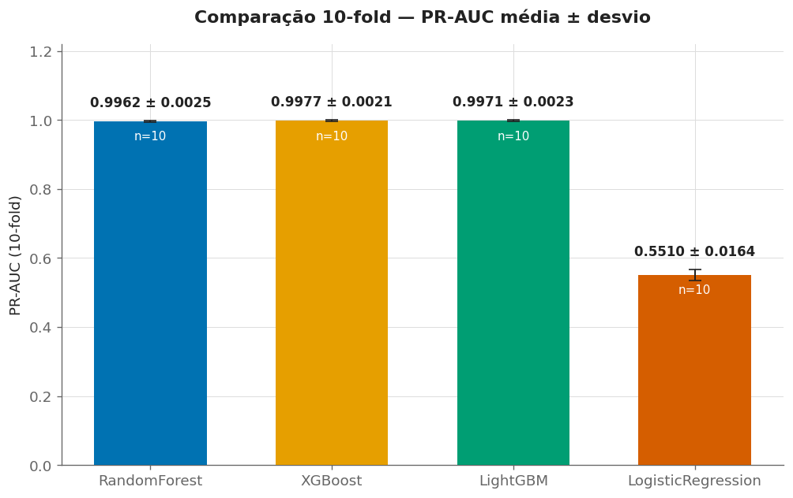
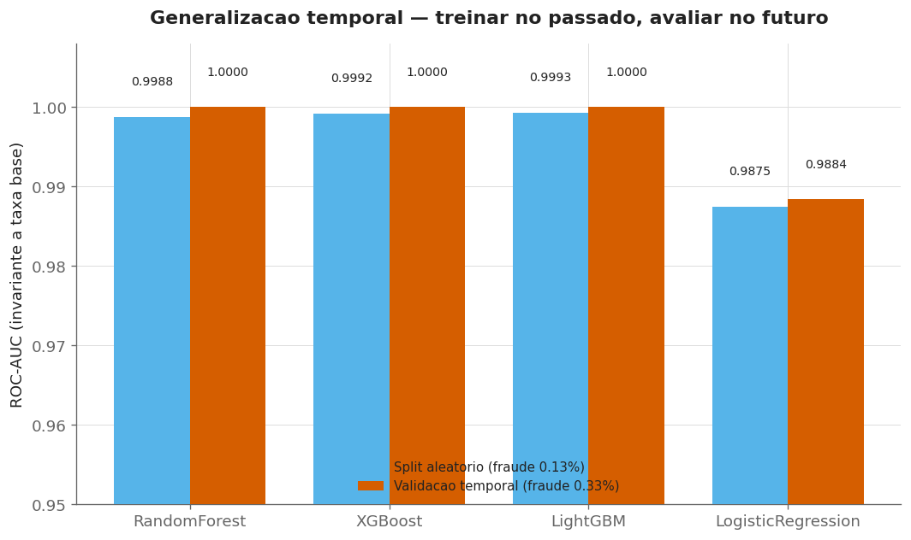
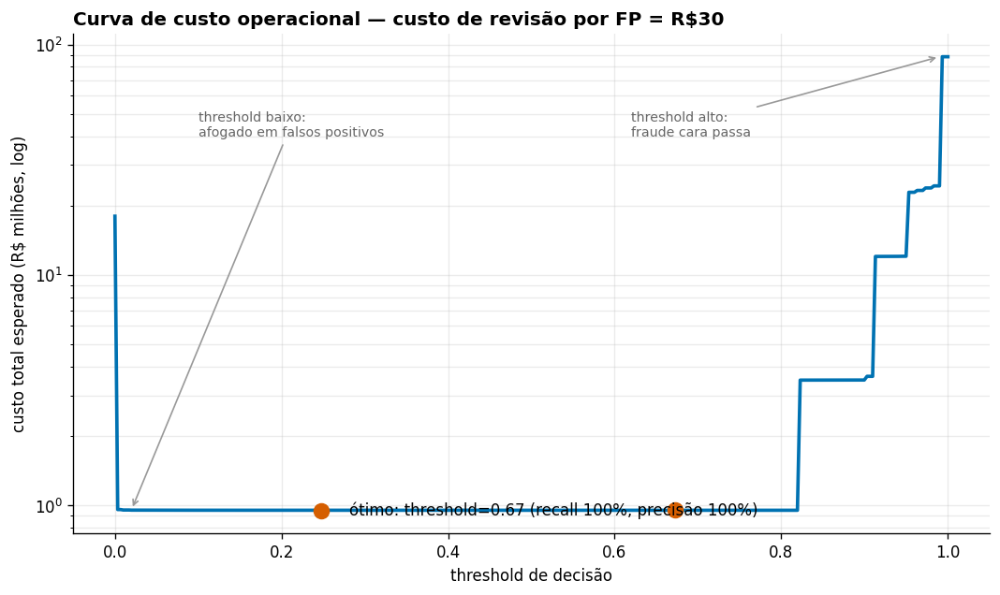
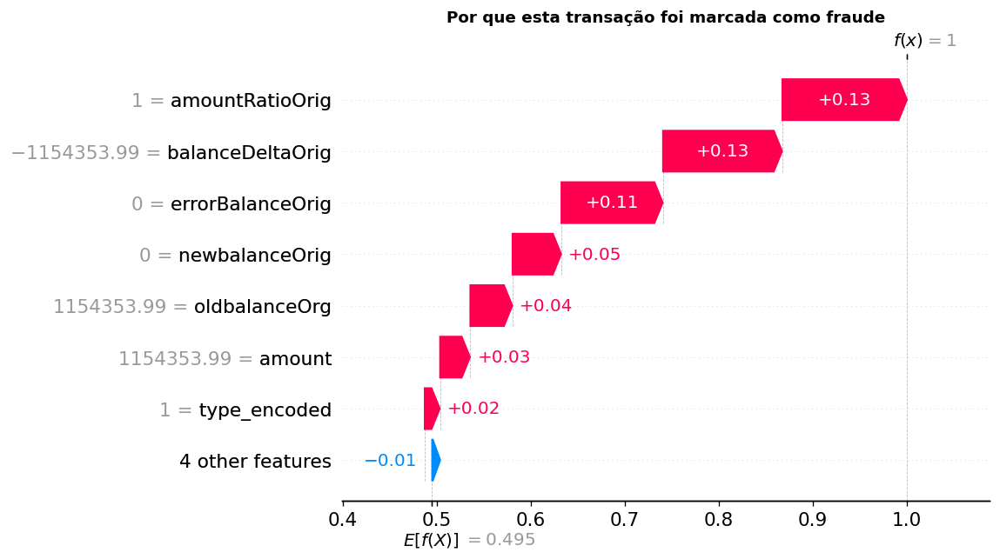

# Fraud Detection

🇧🇷 **Português**  ·  🇬🇧 [English](README.en.md)

> Deteccao de fraudes em transacoes financeiras com Machine Learning, validacao cruzada estratificada e analise em 6.3 milhoes de transacoes.

[](https://www.python.org/)
[](https://scikit-learn.org/)

---

## Sobre o Projeto

Sistema de deteccao de fraudes construido sobre o dataset **PaySim** (6.3 milhoes de transacoes financeiras simuladas). Aborda um dos maiores desafios de pagamentos digitais: identificar fraudes em cenario de extremo desbalanceamento de classes (apenas 0.13% de fraude).

### Contexto

- **R$ 1.8 bilhao** em perdas por fraude no PIX reportadas ate meados de 2022
- **50 mil+ casos mensais** de fraude em pagamentos instantaneos
- Sistemas baseados em regras nao acompanham o volume e a velocidade das transacoes

### Como o projeto evoluiu

1. **Baseline honesto** — comecei corrigindo os modelos de arvore para o desbalanceamento
   extremo (`class_weight` / `scale_pos_weight`); sem isso, "99,87% de acuracia" escondia
   deteccao praticamente zero.
2. **Metrica certa** — adotei a **PR-AUC** como metrica primaria (accuracy e ate ROC-AUC
   enganam com 0,13% de fraude).
3. **Analises de robustez** — concordancia entre modelos (quadrant), fila operacional
   (queue emulation) e sensibilidade da PR-AUC ao tamanho do split.
4. **Escala** — rodei o pipeline no **dataset completo (6,3M)** para numeros reais, nao de amostra.
5. **Eficiencia de dados** — a learning curve mostrou que o sinal e aprendivel com **~30 fraudes**;
   os 6,3M sao redundantes.

---

## Resultados

Executado no **dataset completo** (6.362.620 transacoes, 0,129% fraude; treino 5.090.096 /
teste 1.272.524) no Kaggle em 2026-07-25. Metrica primaria: **PR-AUC**.

### Comparacao de Modelos (validacao cruzada 5-fold, PR-AUC media +/- desvio)

| Modelo | PR-AUC (CV) |
|--------|:-----------:|
| **Random Forest** | **0.9978 +/- 0.0009** |
| XGBoost | 0.9973 +/- 0.0013 |
| LightGBM | 0.9967 +/- 0.0013 |
| Logistic Regression | 0.5547 +/- 0.0097 |

**Melhor modelo (Random Forest) no teste hold-out:** PR-AUC **0.9987** - ROC-AUC 0.9998 -
F1 0.9800 - precisao 0.96 / recall 1.00 (1.643 fraudes). Estavel entre folds (ROC-AUC ~0.9994).

### Metricas de Destaque

- A **Logistic Regression** ilustra o ponto central: ROC-AUC ~0,98 mas PR-AUC de apenas **0,55** —
  com 0,13% de fraude, accuracy e ate ROC-AUC enganam; so a PR-AUC revela a qualidade real.
- **Features engenheiradas dominam:** `amountRatioOrig`, `balanceDeltaOrig`, `errorBalanceOrig`
  (inconsistencia de saldo) pesam mais que os valores brutos.
- **Validacao cruzada estratificada (5-fold)** com media +/- desvio para significancia estatistica.

### Eficiencia de dados — quantas fraudes o modelo realmente precisa?

Learning curve com **conjunto de teste fixo** (1,59M linhas): varia-se **apenas** o tamanho do
treino (subamostragem estratificada, 3 seeds) para isolar o efeito da quantidade de dados.
Resultado: os **tres modelos de arvore (Random Forest, XGBoost, LightGBM) mantem PR-AUC ~0,97–0,999
treinando com apenas ~30 fraudes** — o sinal e aprendivel com pouquissimos exemplos. As 8.213
fraudes / 6,3M linhas sao **massivamente redundantes**, com impacto direto em custo e latencia de
re-treino em producao.





### Robustez — validacao cruzada 10-fold

O 10-fold confirma o 5-fold nos quatro modelos: **XGBoost 0,9977 ± 0,0021**, LightGBM 0,9971 ± 0,0023,
Random Forest 0,9962 ± 0,0025 e Logistic Regression 0,5510 ± 0,0164.



> Licao de tuning de GBDT: XGBoost e LightGBM exigem hiperparametros adequados para o
> desbalanceamento extremo. Os *defaults* das bibliotecas (XGBoost 100 arvores/lr=0,3; LightGBM
> `is_unbalance=True`) **desestabilizam a PR-AUC** — folds inteiros colapsam para ~0,01–0,05
> enquanto o ROC-AUC permanece ~0,9 e **esconde** a falha. Com os configs tunados (500 arvores,
> lr=0,05, regularizacao; `class_weight="balanced"`) os quatro modelos sao estaveis — verificado
> **local e no Kaggle**.

### Validacao temporal — o modelo generaliza para o futuro?

Alem do split aleatorio, reservei o **ultimo periodo** do tempo como **validacao** — dados que
**nunca** entraram no treino nem no teste. Treinando so no passado e avaliando no futuro:



- **A fraude e nao-estacionaria:** ~46% das fraudes estao no ultimo decil de tempo (treino 0,08%
  vs validacao 0,33%). Ainda assim, **o sinal generaliza** — ROC-AUC ~1,0 no futuro.
- **Cuidado metodologico:** PR-AUC **nao** e comparavel entre periodos com taxas base diferentes
  (cresce com a taxa de fraude); usei **ROC-AUC** e **PR-AUC normalizado** para a comparacao justa.
- **Feature drift:** `errorBalanceOrig` (uma top feature global) **perde poder no futuro** — a
  *mecanica* da fraude muda, nao so a taxa. Em producao, exigiria monitorar feature drift, nao so
  queda de performance.

### Analise de custo — qual threshold usar?

O melhor threshold nao e o de maior PR-AUC, e o de **menor custo esperado**: cada **falso negativo**
custa o **valor real** da fraude que passou (o `amount`); cada **falso positivo** custa a revisao de
um analista. Com custo de revisao de R$30, o ponto otimo fica em **recall 99,6% / precisao 100%** —
os dois regimes de falha (threshold baixo = afogado em falsos positivos; alto = fraude cara passa)
aparecem nas pontas da curva.



### Por que PR-AUC e nao Acuracia?

Em datasets com 99.87% de transacoes legitimas, um modelo que classifica tudo como "nao-fraude" teria 99.87% de acuracia. A PR-AUC avalia especificamente a capacidade do modelo de encontrar fraudes reais (recall) sem gerar excesso de falsos alarmes (precision).

---

## Dataset — PaySim

| Caracteristica | Valor |
|----------------|-------|
| Transacoes | 6,362,620 |
| Atributos | 11 features no modelo (5 originais mantidas + 6 construidas) |
| Fraudes | 8,213 (0.13%) |
| Periodo | 30 dias simulados |
| Tipos | CASH_IN, CASH_OUT, DEBIT, PAYMENT, TRANSFER |

**Descoberta relevante:** Fraudes concentram-se em apenas 2 tipos: TRANSFER (0.77%) e CASH_OUT (0.18%). Os demais tipos tem taxa de fraude zero.

---

## Arquitetura do Pipeline

```
Dados Brutos (6.362.620 transacoes, 11 colunas)
  |
  v
Engenharia de Atributos (6 construidas)
  |-- balanceDeltaOrig / balanceDeltaDest   (variacao de saldo origem/destino)
  |-- errorBalanceOrig / errorBalanceDest    (inconsistencia contabil do saldo)
  |-- amountRatioOrig                          (valor / saldo de origem)
  |-- type_encoded                             (tipo de transacao codificado)
  |   descarta: nameOrig, nameDest, step, type bruto, isFlaggedFraud
  |
  v
Split Estratificado Treino/Teste (80/20 -> 5,09M / 1,27M, preserva 0,13% de fraude)
  |
  v
5-Fold Stratified CV no TREINO   (comparacao de modelos por PR-AUC)
  |
  v
Melhor Modelo: Random Forest
  |
  v
Avaliacao no TESTE hold-out (1,27M)   ->   PR-AUC 0,9987
```

---

## Destaques Tecnicos

- **Desbalanceamento extremo** tratado com metricas adequadas (PR-AUC, nao acuracia)
- **6 atributos construidos** a partir de padroes de saldo e tipo de transacao
- **Otimizacao de memoria** com dtypes ajustados para processar 6.3M de linhas
- **Divisao estratificada** que preserva a proporcao de fraude em treino/teste e em cada fold

---

## Analises Avancadas

### Quadrant Analysis (concordancia entre modelos)

Concordancia/discordancia entre os 4 modelos via predicoes out-of-fold (5-fold).
**Resultado:** com o config tunado, os 4 modelos sao **altamente concordantes (~97%)**; a pequena
**zona de discordancia (~3%) e modestamente enriquecida em fraude (~1,7x a taxa base)** — um sinal
secundario para priorizar revisao humana.

### Queue Emulation (throughput de inferencia)

Mede o throughput de inferencia (transacoes/segundo) de cada modelo em batch.
**Resultado — trade-off velocidade x acuracia:** o RandomForest e o mais preciso (PR-AUC 0,998)
mas o **mais lento** (~19k tx/s em batch de 512); os **GBDTs tunados (XGBoost ~179k, LightGBM
~156k tx/s) sao ~8-10x mais rapidos** com PR-AUC ~0,997; a LogisticRegression e a mais rapida
(~911k tx/s) mas com PR-AUC de apenas 0,55. Para producao de **alto volume**, um GBDT tunado e o
melhor equilibrio acuracia/velocidade.


### PR-AUC Splits Analysis

Sensibilidade da PR-AUC a proporcao treino/teste (50-90%, 3 repeticoes).
**Resultado:** a PR-AUC do RandomForest fica **estavel em ~0,9999 de 50% a 90% de treino** —
insensivel ao tamanho do split (reforca a eficiencia de dados da learning curve).


### Explicabilidade (SHAP) — por que cada alerta?

Cada predição é atribuída às features que a empurraram (auditabilidade — o analista precisa saber
*por que* um alerta disparou). Ex.: uma transação que **esvaziou uma conta de R$1,15M** é marcada
como fraude com f(x)=1,0, e o SHAP mostra exatamente quais sinais pesaram. A propriedade de
aditividade do SHAP foi validada por teste (soma dos SHAP + base = probabilidade, erro ~1e-14).



---

## Tecnologias

| Categoria | Tecnologias |
|-----------|-------------|
| ML | scikit-learn (LR, DT, RF, GBM), XGBoost, LightGBM |
| Dados | pandas, NumPy |
| Visualizacao | Matplotlib, Seaborn, UMAP |
| Avaliacao | StratifiedKFold (CV), holdout temporal, PR-AUC, ROC-AUC, Confusion Matrix |
| Qualidade | pytest (58 testes), black, isort, flake8, GitHub Actions |

---

## Autor

**Fernando Marciano** — [LinkedIn](https://www.linkedin.com/in/fernandopmarciano/)

---

> Interessado no codigo-fonte ou em uma demonstracao? Entre em contato pelo [LinkedIn](https://www.linkedin.com/in/fernandopmarciano/).
