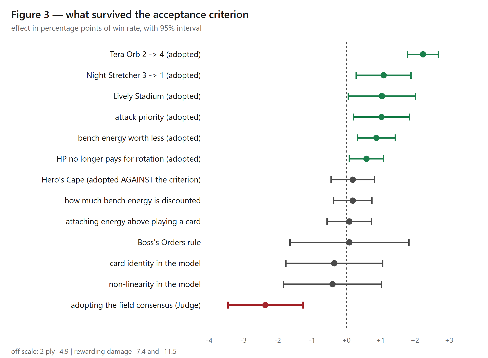
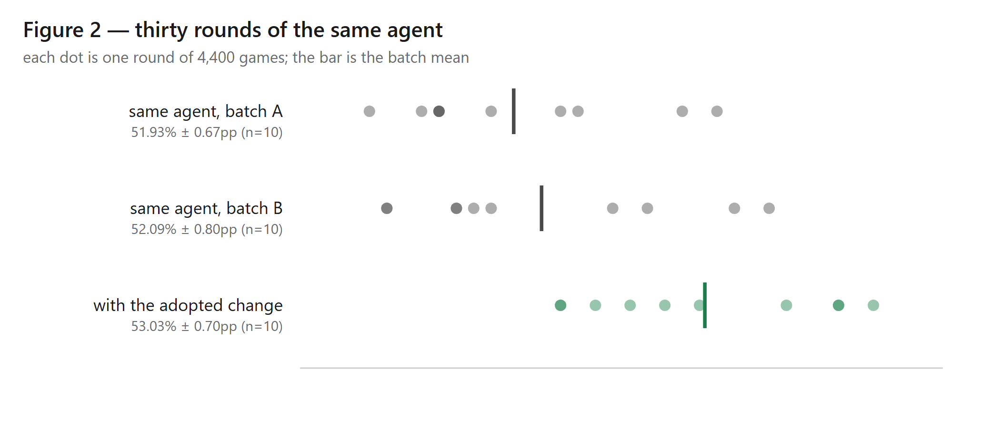
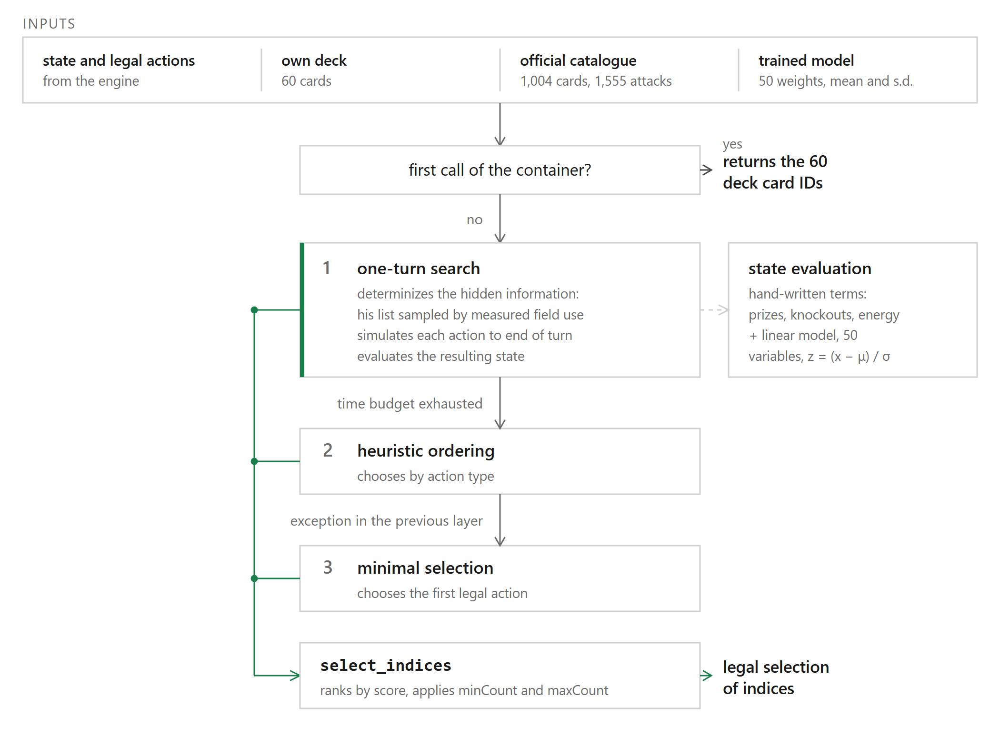

# Pokémon TCG Agent — Acoplamento Deck-Política

> Um agente de Pokémon TCG construído para competir virou um experimento de medição: 37 pontos percentuais de vitória atribuídos ao agente pertenciam, na verdade, às cartas.

---

## O hackathon

O **Pokémon TCG AI Battle Challenge** foi organizado pela The Pokémon Company em
parceria com Kaggle, o Matsuo Institute (Universidade de Tóquio) e a HEROZ, com
premiação total acima de **US$ 300.000**.

A competição teve duas trilhas conectadas:

| Trilha | O que era | Encerramento |
|--------|-----------|--------------|
| **Simulation** | Ladder contínua de partidas automáticas entre agentes | submissões finais em **16/08/2026** |
| **Strategy** | Relatório escrito explicando a lógica estratégica do agente | entrada em **06/09/2026**, encerramento em **13/09/2026** |

Participei da trilha **Strategy**. A fase Kaggle correu de **junho a agosto de
2026**, com final presencial no Japão em setembro.

> **Este projeto não recebe mais atualizações.** O desenvolvimento acompanhou a
> competição e terminou com ela, em **13/09/2026**. A bancada experimental foi
> encerrada junto: o código permanece como estava no momento da submissão.

---

## Sobre o Projeto

Taxa de vitória costuma ser reportada como propriedade do agente que a produziu.
O trabalho mostra que, no Pokémon TCG, essa atribuição não se sustenta — e
propõe um procedimento para separar os dois fatores realmente responsáveis pelo
resultado: a **lista de sessenta cartas** e a **política de decisão** que a
conduz.

### A virada aconteceu por acidente

O projeto começou como tentativa de construir um agente forte e virou tentativa
de medir um. Durante o benchmark contra o agente público mais forte disponível,
apareceu uma anomalia que não deveria ser possível: dar ao adversário **dez
vezes mais tempo de pensamento melhorava consistentemente a nossa própria taxa
de vitória**.

Busca que enxerga mais longe só piora o jogo quando a função otimizada está
desalinhada com a posição na mesa. Isso apontava para a avaliação do adversário,
não para a nossa. A inspeção confirmou: as heurísticas dele referenciam seis
cartas por identificador numérico, e o benchmark o rodava com um deck para o
qual ele nunca foi escrito.

Devolvendo a lista original dele, **sem tocar em uma linha da política**, o
resultado foi de 53,9% para 16,7%.

Trinta e sete pontos percentuais tinham sido atribuídos a um agente e pertenciam
às cartas. Isso levantou a pergunta óbvia sobre os nossos próprios números, e o
resto do projeto é a tentativa de respondê-la com honestidade: fixar um fator,
variar o outro, e ver quanto de taxa de vitória sobrevive.

---

## Resultados

Sobrevive mal. Toda medida abaixo vem com intervalo de confiança de 95%.

### O mesmo agente, listas diferentes

| Configuração | Taxa de vitória |
|---|---|
| Política própria, lista própria | **51,7%** [50,5; 52,9] |
| Política própria, lista dos organizadores | **35,8%** [34,0; 37,6] |

A política não mudou. A lista sim.

### Quanto vale a política, isolada

A mesma política vale **7,5 pontos percentuais** sobre a linha de base nula
quando conduz uma lista que joga a carta em torno da qual sua função de
avaliação foi desenhada — e **0,7 ponto** numa lista que não joga.

### O controle que fecha o argumento

Sem política nenhuma dos dois lados, a lista sozinha ainda vence **89,2%**
[88,0; 90,2] do confronto em que a política parecia mais valiosa.

Dos 94,6% vencidos com política de um lado, **89,2 pontos pertencem à lista e
5,5 à política**. O espelho — lista contra ela mesma — volta a 48,4%.

A maior parte do desfecho é decidida antes de qualquer agente jogar uma carta.

### O ruído foi medido antes das conclusões

O mesmo binário, executado em momentos diferentes, produziu **51,93% ± 0,67** e
**52,09% ± 0,80**. Conhecer essa dispersão é o que permite distinguir efeito real
de flutuação — sem ela, qualquer diferença de dois ou três pontos seria
indistinguível de sorte.

---

## Destaques Técnicos

- **Protocolo de atribuição.** Procedimento que separa contribuição da lista e
  contribuição da política, fixando um fator e variando o outro, com linha de
  base nula (sem política) como controle.
- **Estatística antes de conclusão.** Dispersão entre replicatas medida primeiro;
  intervalo de confiança em toda taxa reportada; nenhuma porcentagem publicada
  sem N e incerteza.
- **Auditoria do modelo aprendido.** Concordância entre o modelo e jogadores
  humanos medida por arquétipo — 34,7% no conjunto completo e 59,2% restrito ao
  arquétipo próprio, o que mostra que o modelo aprendeu o próprio deck, não o
  jogo.
- **Correção de função de avaliação por evidência.** Peso de energia no banco
  zerado depois de medir que o agente começava 23,7% dos turnos com o Pokémon
  errado.
- **Números retratados quando a remedição não sustentou.** Uma rodada de
  auditoria derrubou o maior ganho que o projeto havia reivindicado; o número
  saiu do relatório em vez de sobreviver por conveniência.

---

## Arquitetura

O agente escolhe entre as opções **legais** apresentadas pelo engine da
competição (`cabt`), a cada ponto de decisão do turno. A política combina:

- ordem de prioridade entre tipos de ação, derivada de observação de jogo humano;
- função de avaliação de posição, com pesos corrigidos por medição;
- tratamento específico da carta central do arquétipo escolhido.

A submissão da trilha Simulation era um pacote com `main.py` (implementando
`agent(obs_dict) -> list[int]`) e `deck.csv` com os 60 identificadores de cartas.

---

## Tecnologias

`Python 3.12` · `NumPy` · `pandas` · `matplotlib` · `pytest` ·
engine `cabt` (fornecido pela competição) · execução paralela de arenas para
acumular replicatas

---

## Autor

**Fernando Marciano** — Mestre em Engenharia Elétrica (Inteligência
Computacional e Machine Learning), graduado em Física.

---

## Licenca

Todos os direitos reservados. Este diretório é material de vitrine: descreve o
trabalho e seus resultados, sem distribuir o código do agente.
