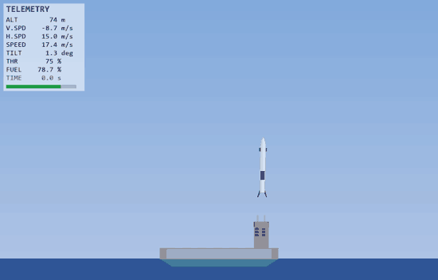
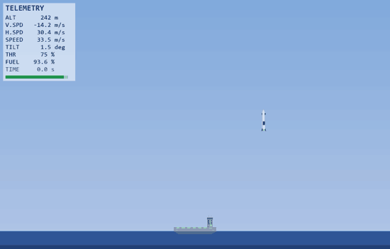

# Rocket Landing RL

> Pouso autonomo de foguete em navio-drone (ASDS) com fisica 6DOF e neuroevolucao — o agente inclina o corpo para voar ate a barca e endireita para pousar, como um booster real.

[](https://www.python.org/)
[](#)
[](#)
[](#licenca)

---

## Sobre o Projeto

Simulacao fisica completa de um foguete (inspirado na recuperacao do booster Falcon 9) com jogo interativo em pygame e pipeline de treinamento por **neuroevolucao** (algoritmo genetico): o agente aprende a pousar na barca vindo de ate 160 m de distancia, controlando empuxo e rotacao.

O diferencial da versao atual e o **controle realista rotate-and-thrust**: as acoes de inclinacao viram um comando de taxa de rotacao fly-by-wire (±40°/s) — para se deslocar lateralmente o agente precisa *inclinar o corpo e empurrar*, exatamente como um foguete de verdade. Nada de deslizar de lado "em pe".



> O agente inclina ate ~40° na aproximacao, freia, endireita e toca o deck com ~0,4° de inclinacao — telemetria ao vivo (altitude, velocidades, inclinacao, throttle, combustivel).



> Aproximacao completa a partir de **156 m de distancia**: cruzeiro inclinado na direcao da barca, flip de frenagem e pouso vertical.

---

## Resultados

Modelo oficial (best-validation, geracao 105 de uma run de ~12 h, populacao 200):

| Fase de aproximacao (downrange) | Taxa de pouso (n=40, seeds held-out) |
|---------------------------------|--------------------------------------|
| Fase 1 (25–45 m)   | **85–88%** |
| Fase 6 (140–160 m) | **75%**    |

Metricas de realismo comportamental (protocolo proprio, alem da taxa de pouso):

| Metrica | Valor |
|---------|-------|
| Inclinacao maxima em voo | ~31–40° (inclina de verdade para se deslocar) |
| Inclinacao no toque | **~1,6°** (endireita para pousar) |
| Uso do comando de rotacao | 98% dos passos |

---

## Destaques Tecnicos

- **Fisica 6DOF realista**: gravidade, arrasto, gimbal TVC, RCS, depleicao de massa, vento, CG baixo (instabilidade de pendulo)
- **Curriculo de aproximacao (fly-in)**: 6 fases progressivas, nascendo cada vez mais longe (25 → 160 m) com velocidade de entrada
- **Reward anti-hover**: timeout punido pior que crash e bonus de descida pago *por metro* (nao por passo) — eliminou o otimo local de "pairar" que travou 4 runs anteriores
- **Validacao com seeds held-out + early stopping**: o melhor modelo por validacao (gen 105) venceu o melhor por fitness de treino (gen 150) no protocolo real
- **Jogo interativo** (pygame): voo manual, corrida de 8 IAs, espectador navegando geracoes e replay acelerado do treinamento
- **Treino headless paralelo** com snapshots por geracao e checkpoint completo da populacao
- **404 testes** automatizados (fisica, env, reward, GA, modos de jogo em SDL headless)

---

## Arquitetura

```
Fisica 6DOF (dt=0.02s) → Env Gymnasium (obs 7D, MultiDiscrete [5 throttle × 3 rotacao])
    → Neuroevolucao GA (pop 200, rede [7, 64, 32, 8] = 1.480 parametros)
    → Validacao held-out por geracao → best-val checkpoint → jogo/GIFs
```

Baseline PPO (Stable-Baselines3) incluido para comparacao com o GA.

---

## Tecnologias

Python, NumPy, Gymnasium, pygame, multiprocessing (treino paralelo), Stable-Baselines3 (baseline PPO), pytest.

---

## Autor

**Fernando Marciano** — [LinkedIn](https://www.linkedin.com/in/fernandopmarciano/)

---

## Licenca

**All Rights Reserved** — codigo-fonte em repositorio privado.

> Interessado no codigo ou em uma demonstracao? Entre em contato pelo [LinkedIn](https://www.linkedin.com/in/fernandopmarciano/).
